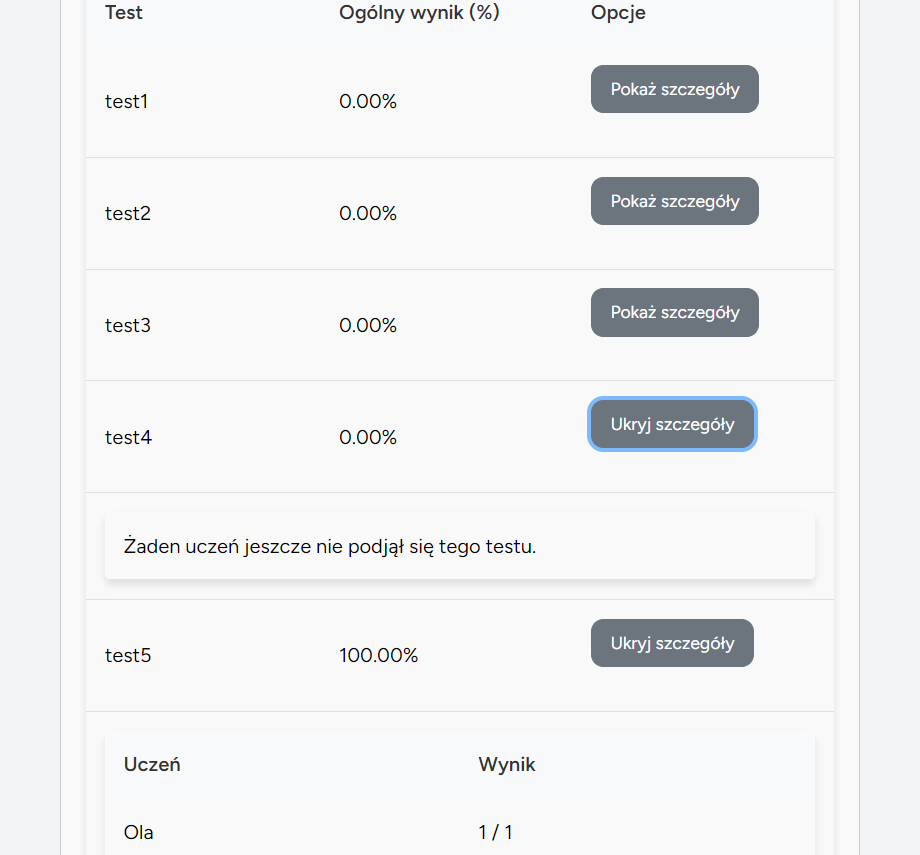

# Opis Aplikacji

## Strona logowania
Konto nauczyciela jest tworzone poprzez `TeacherSeeder.php`, a konta uczniów tworzy nauczyciel co będzie pokazane niżej.

## Strona główna nauczyciela
Na której może przejść do zarządzania klasami, testami, zestawami pytań, użytkownikami i przeglądać wyniki uczniów z testów.

## Strona do zarządzania klasami
Które można edytować i usuwać.

Kliknięcie w „Szczegóły” pokazuje uczniów przypisanych do klasy, jak i również można przypisać kolejnych uczniów.

Dodawanie nowej klasy.

## Strona do zarządzania testami
Które można edytować i usuwać.

Dodawanie nowego testu.
Należy ustalić nazwę testu, wybrać pytania z zestawu pytań danego nauczyciela, test można przypisać do jakiejś klasy lub do danego ucznia.

## Strona do zarządzania pytaniami
Które można edytować i usuwać.

Dodawanie nowego pytania.
Należy wpisać pytanie oraz 4 różne odpowiedzi, zaznaczając tylko jedną która jest prawidłowa.

## Strona do zarządzania użytkownikami
Których można edytować i usuwać.

Dodawanie nowego użytkownika.
Należy podać imię, maila i ustalić hasło.

## Strona do przeglądania wyników uczniów, klas lub poszczególnego testu.

Aby przeglądać wyniki danego ucznia należy wpisać jego email. Pokażą się wyniki dla testów ukończonych oraz przypisane testy ale jeszcze nie ukończone. Każdy test można rozwinąć klikając „Szczegóły” i sprawdzić poprawne i niepoprawne odpowiedzi ucznia.

Aby przeglądać wyniki poszczególnej klasy należy kliknąć „Pokaż testy”. Pokaże się każdy test przypisany do danej klasy z wynikiem procentowym, a klikając w „Pokaż szczegóły” , pokaże się informacja o wyniku danego ucznia lub jeśli jeszcze żaden uczeń nie podjął się rozwiązania testu to informacja „Żaden uczeń jeszcze nie podjął się tego testu.”

Aby przeglądać wyniki poszczególnego testu należy kliknąć „Pokaż szczegóły” , pokaże się informacja o wyniku danego ucznia lub jeśli jeszcze żaden uczeń nie podjął się rozwiązania testu to informacja „Żaden uczeń jeszcze nie podjął się tego testu.”

## Strona do edycji swojego profilu
Możliwa wyłącznie dla nauczyciela.

## Strona główna ucznia
Pokazują się na niej dostępne testy podzielone na te przydzielone dla danego ucznia lub na całej klasy do której dany uczeń należy oraz przycisk do przeglądania swoich wyników testów.

Aby rozwiązać test należy kliknąć „Rozwiąż test”, uczeń przechodzi do testu i pokazują się od razu wszystkie pytania z danego testu, pytania i odpowiedzi za każdym razem są w innej kolejności. Po zakończeniu testu uczeń klika zapisz odpowiedzi, nie musi on zaznaczyć odpowiedzi przy każdym pytaniu, co wiąże się oczywiście z brakiem punktu. Pokazują się wynik testu i odpowiedzi: „Twoja odpowiedź – Poprawna” lub „Twoja odpowiedź – Niepoprawna” i przy poprawnej odpowiedzi „Poprawna odpowiedź”.

Klikając na stronie głównej ucznia w „Moje wyniki” uczeń może przeglądać swoje wyniki z testów przydzielone bezpośrednio do niego lub do klasy w której jest. Po kliknięciu w „Szczegóły” pokazuje się taki sam widok z odpowiedziami jak po ukończeniu testu.

